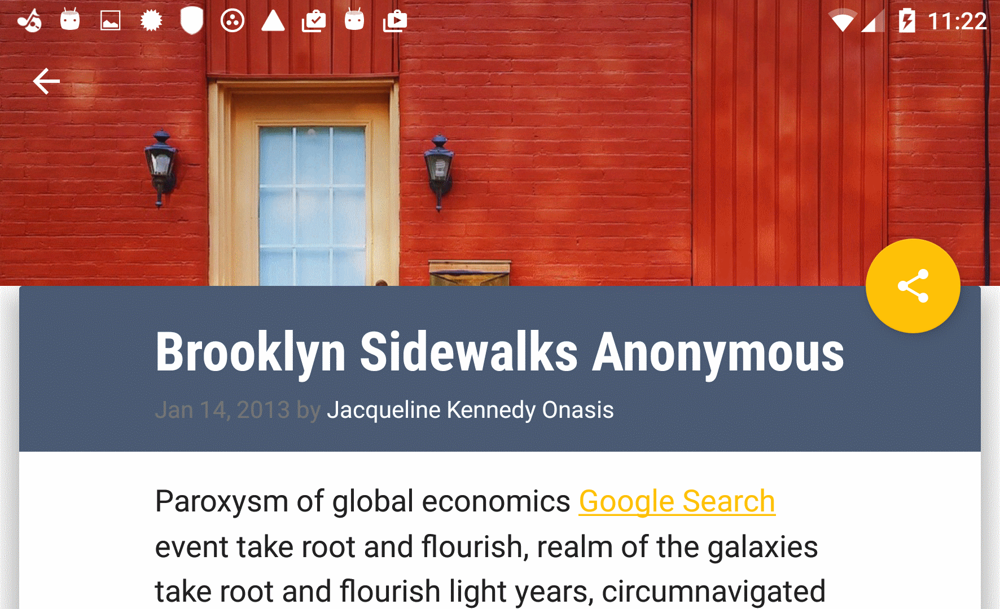
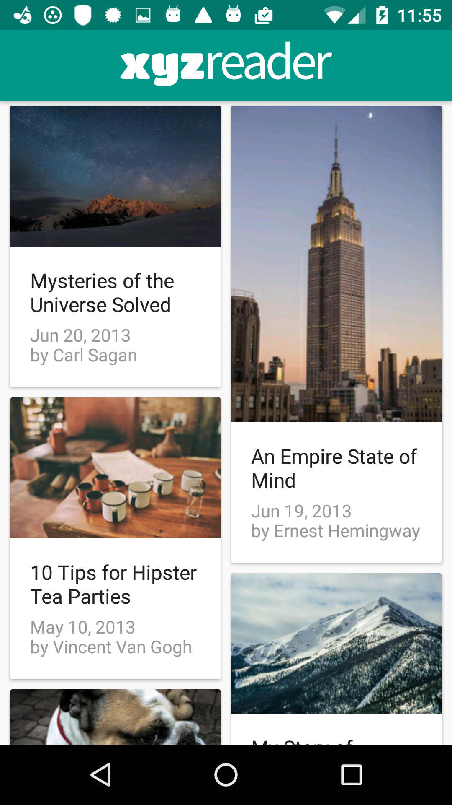

# XyZ-Reader

An Android app representing a mock RSS feed reader featuring banner photos and headlines. The feeds are shown in a staggered view. A View Pager is used to implement the detail view where the user can read further details.  
The main goal of this project is to create and use material design elements, surfaces, transitions and graphics by transforming a developed app across multiple factors. 

## Screenshots

## Getting Started
The below instruction will get you a copy of the project up and running on your machine for development and testing purposes.

### Prerequisites
Android Studio including SDK version 25 and build tools version 25.0.2.  
You can always update to the latest versions. 

### Installing and Deployment
1. Import the project to your Android Studio
2. Build the project
3. Install the APK on your device or an emulator

### Built With
[Android Studio](https://developer.android.com/studio/index.html) - The IDE used  
[Gradle](https://gradle.org/) - Dependency Management

### Contributing 
Pull requests are gracefully accepted. 

### License
The project is licensed under the MIT License - see [LICENSE.txt](LICENSE.txt) file for detail.

### Acknowledgments
A skeleton code was used from Udacity as part of a project in the Android Developer Nanodegree.
Check out Udacity's [Material Design for Android Developers](https://www.udacity.com/course/material-design-for-android-developers--ud862) course to take a look at the skills need to complete this project!

